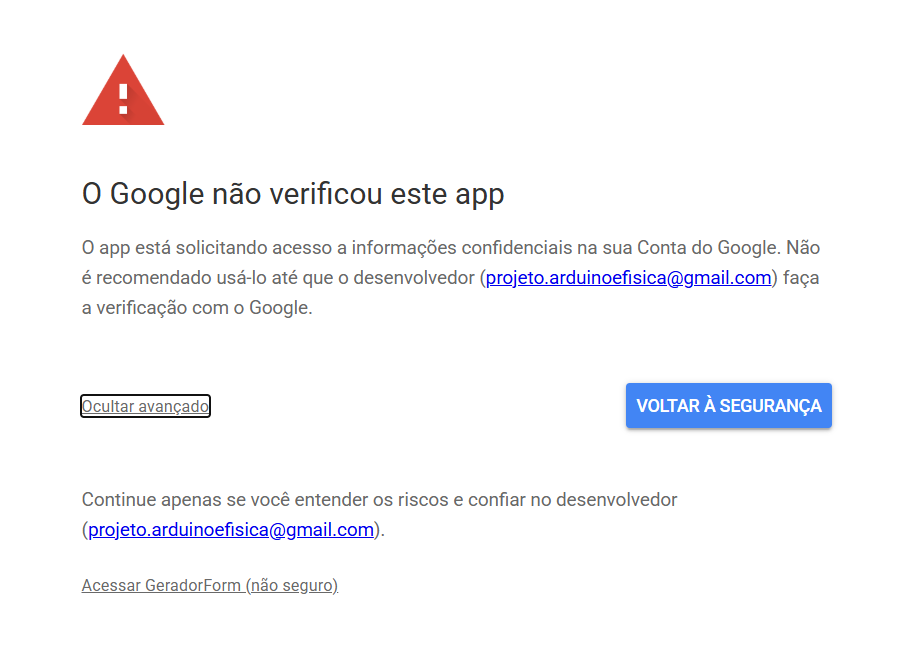
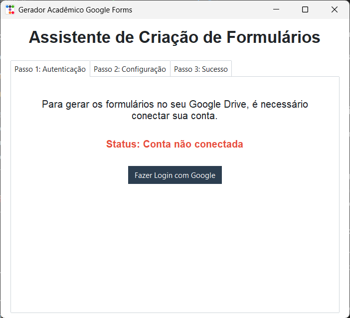
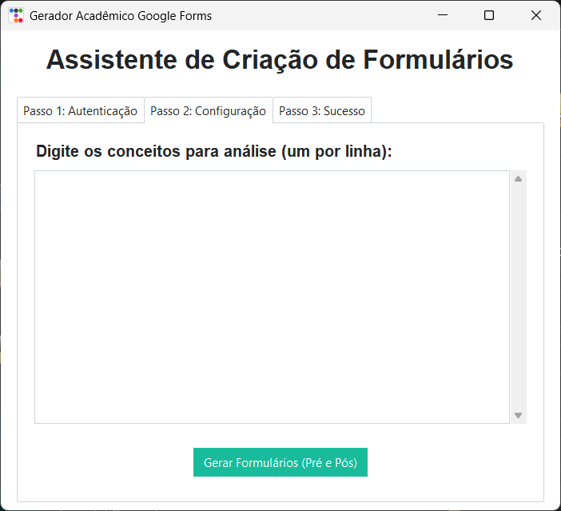
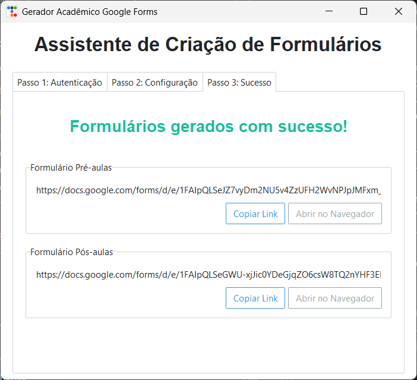

# Gerador de Formulários Google para Análise de Similaridade

Este aplicativo é uma ferramenta desktop desenvolvida em Python para automatizar a criação de questionários de coleta de dados de similaridade no Google Forms. Ele foi projetado especialmente para apoiar pesquisas e experimentos que utilizam **Escalonamento Multidimensional (Multidimensional Scaling - MDS)**, permitindo gerar de forma simples e rápida as matrizes de comparação par a par necessárias para o modelo.

---

## 📌 Sumário

- 🔍[Como o Programa Funciona](#como-o-programa-funciona)
  - [1. Estrutura e Arquitetura do Código](#1-estrutura-e-arquitetura-do-código)
  - [2. Lógica de Geração de Questões e Par a Par](#2-lógica-de-geração-de-questões-e-par-a-par)
  - [3. Divisão Dinâmica de Seções](#3-divisão-dinâmica-de-seções)
  - [4. Estrutura Padrão dos Formulários Gerados](#4-estrutura-padrão-dos-formulários-gerados)
- 📖[Guia de Utilização Passo a Passo](#guia-de-utilização-passo-a-passo)
  - [Passo 1: Inicialização e Login](#passo-1-inicialização-e-login)
  - [Passo 2: Configuração dos Conceitos](#passo-2-configuração-dos-conceitos)
  - [Passo 3: Links Gerados e Sucesso](#passo-3-links-gerados-e-sucesso)
- 🛠️[Guia do Desenvolvedor](#guia-do-desenvolvedor)
  - 📋[Pré-requisitos e Dependências](#pré-requisitos-e-dependências)
  - 🔑[Configurando Credenciais da API do Google](#configurando-credenciais-da-api-do-google)
  - 🚀[ Executando Localmente em Desenvolvimento](#executando-localmente-em-desenvolvimento)
  - 📦[Compilando para um Executável Independente (.exe)](#compilando-para-um-executável-independente-exe)

---

## 🔍 Como o Programa Funciona

O programa automatiza todo o processo de criação de formulários por meio da API do Google Forms, poupando o usuário de criar dezenas ou centenas de perguntas manualmente.

### 1. Estrutura e Arquitetura do Código
O projeto segue uma arquitetura modular em camadas, localizada na pasta [`app/`](app):
*   **Interface Gráfica (UI):** Centralizada em [`app/ui/main_window.py`](app/ui/main_window.py), construída com Tkinter e estilizada de forma moderna com a biblioteca `ttkbootstrap` (tema *Flatly*).
*   **Serviços de Autenticação (Auth):** Localizados em [`app/services/auth_service.py`](app/services/auth_service.py), gerenciam a autenticação OAuth2 com o Google, controlando fluxos de login no navegador, salvamento local de token para login automático (`token.json`) e logout.
*   **Serviços de Formulários (Forms):** Localizados em [`app/services/forms_service.py`](app/services/forms_service.py), estruturam e disparam as requisições em lote (`batchUpdate`) para construir os formulários no Google Drive do usuário logado.
*   **Utilitários de Combinação:** Localizados em [`app/utils/combinations.py`](app/utils/combinations.py), cuidam dos cálculos matemáticos de pares de conceitos e divisão ideal de questões por seção.

### 2. Lógica de Geração de Questões e Par a Par
Para um conjunto de $N$ conceitos inseridos pelo usuário, o algoritmo gera todas as combinações possíveis de pares de conceitos sem repetição e sem importar a ordem, utilizando a função `combinations` do Python. 
*   **Número de pares:** O total de perguntas de similaridade será dado por:
    $$\text{Total de Pares} = \frac{N \times (N - 1)}{2}$$
*   **Exemplo:** Se o usuário inserir 5 termos (ex: *Massa, Energia, Velocidade, Força, Aceleração*), o programa gerará automaticamente $10$ pares exclusivos para comparação.

### 3. Divisão Dinâmica de Seções
Para evitar que o respondente fique cansado ao ver dezenas de perguntas de escala linear em uma única página, o arquivo [`app/utils/combinations.py`](app/utils/combinations.py) calcula de forma dinâmica a divisão de seções (`gerar_divisao_secao`), limitando a um máximo de aproximadamente 10 questões por página do formulário, inserindo quebras de seção (`pageBreakItem`) automaticamente.

### 4. Estrutura Padrão dos Formulários Gerados
Para cada lote, o programa gera sempre **dois formulários idênticos** em estrutura, mas com propósitos temporais diferentes (úteis para avaliar o ganho de aprendizagem antes e depois de uma intervenção didática):
1.  **Formulário Pré-aulas** (Ex: `Análise de Similaridade (Pré-aulas)`)
2.  **Formulário Pós-aulas** (Ex: `Análise de Similaridade (Pós-aulas)`)

Cada formulário gerado contém:
*   **Descrição detalhada das instruções:** Orienta o respondente a avaliar a similaridade em uma escala de 1 (altamente relacionado) a 9 (sem relação).
*   **Dados de Identificação:**
    *   *Código de Identificação* (Campo aberto de texto obrigatório, para cruzar dados do pré e pós-teste preservando o anonimato).
    *   *Grupo* (Seleção única: Aluno / Professor).
    *   *Nível de Familiaridade* (Lista suspensa: Nenhum, Baixo, Médio, Alto, Avançado).
*   **Questões de Escala Linear:** Cada par gerado é inserido como uma pergunta obrigatória de escala linear de 1 a 9, com marcadores ("Fortemente Relacionado" no 1 e "Fracamente Relacionado" no 9).

---

## 📖 Guia de Utilização Passo a Passo

Siga os passos abaixo para operar a interface gráfica do programa e criar seus formulários.

> [!NOTE]
> Para utilizar o programa, você precisará de uma conta Google ativa para a qual os formulários serão transferidos e salvos.

### Passo 1: Inicialização e Login
1. Inicie o aplicativo (seja executando o arquivo consolidado `.exe` ou via terminal).
2. Na aba **Passo 1: Autenticação**, clique no botão **Fazer Login com Google**.
3. O aplicativo abrirá automaticamente o navegador padrão do seu sistema, solicitando que você escolha sua conta Google e dê as permissões necessárias (acesso para criar formulários no Google Drive).
   
   > [!IMPORTANT]
   > **Aviso de Aplicativo Não Verificado (Tela do Navegador):**
   > Por se tratar de um cliente de API do Google Cloud de uso simples/pessoal e não verificado comercialmente pelo Google (o que não é necessário para este tipo de aplicação), o navegador exibirá um aviso de que *"O Google não verificou este app"* ao tentar fazer login.
   >
   > Para prosseguir normalmente:
   > 1. Clique no link **Avançado** (*Advanced*) no canto inferior esquerdo da tela de aviso do Google.
   > 2. Clique no link **Acessar GeradorFormulario (não seguro)** (ou o nome do projeto correspondente).
   > 3. Na tela seguinte, confirme as permissões marcando os campos necessários e clique em **Continuar**.
   >
   > #### Tela de Alerta do Google (Exemplo):
   > 
   > <!-- -->
   > <!-- *(Insira aqui o screenshot da tela do navegador exibindo o aviso do Google de app não verificado)* -->

4. Uma vez autorizado, o navegador exibirá uma mensagem de sucesso e você poderá retornar à janela do aplicativo.
5. O status na interface mudará para **Conectado como: [Seu Nome]** e o botão de logout/desconexão ficará visível caso deseje trocar de conta.

   > [!NOTE]
   > **Persistência do Login (token.json):**
   > Após concluir o login com sucesso, um arquivo contendo as credenciais de acesso autorizadas é gravado localmente na pasta pessoal do seu usuário do sistema em `~/.form_generator/token.json` (no Windows, o caminho corresponde a `C:\Users\<SeuUsuario>\.form_generator\token.json`).
   > 
   > Este arquivo possibilita a reconexão automática ao iniciar o programa futuramente. Se você clicar em **Desconectar / Trocar de Conta**, o arquivo `token.json` será automaticamente removido do disco por segurança.

#### Visualização da Tela de Autenticação:

<!--  -->
<!-- *(Insira aqui o screenshot da tela inicial mostrando o botão de login e o status desconectado)* -->

---

### Passo 2: Configuração dos Conceitos
1. O aplicativo selecionará automaticamente a aba **Passo 2: Configuração**.
2. No campo de texto centralizado, insira a lista de termos/conceitos acadêmicos que deseja analisar.
3. **Regra de ouro:** Digite exatamente **um conceito por linha**. Não utilize vírgulas, numeração ou separadores adicionais.
4. Após revisar os conceitos inseridos, clique no botão **Gerar Formulários (Pré e Pós)**.

#### Visualização da Tela de Configuração:

<!--  -->
<!-- *(Insira aqui o screenshot mostrando a lista de conceitos preenchida no campo de texto e o botão de geração)* -->

---

### Passo 3: Links Gerados e Sucesso
1. O programa exibirá uma barra/mensagem de processamento. Aguarde alguns segundos enquanto as requisições são enviadas para a API do Google.
2. Ao concluir, a aba **Passo 3: Sucesso** será desbloqueada e exibida automaticamente.
3. Você verá dois painéis, um para o formulário de **Pré-aulas** e outro para o de **Pós-aulas**.
4. Em cada painel, você pode:
    *   **Copiar Link:** Copia a URL direta para enviar aos respondentes.
    *   **Abrir no Navegador:** Abre a página de visualização do Google Forms gerado para conferência de layout e respostas.

#### Visualização da Tela de Sucesso:

<!--  -->
<!-- *(Insira aqui o screenshot da aba final exibindo as URLs geradas e os respectivos botões de ação)* -->

---

## 🛠️ Guia do Desenvolvedor

Esta seção orienta como configurar o ambiente de desenvolvimento, executar o script localmente e compilar o código em um executável (.exe) independente.

### 📋 Pré-requisitos e Dependências
Certifique-se de possuir o Python 3.8 ou superior instalado. No terminal, na raiz do repositório, instale todas as dependências requeridas utilizando o arquivo [`requirements.txt`](../requirements.txt):

```bash
pip install -r requirements.txt
```

As principais bibliotecas usadas por este módulo são:
*   `google-api-python-client` & `google-auth-oauthlib`: Para comunicação com a API do Google Forms e fluxo OAuth2.
*   `ttkbootstrap`: Para renderização da interface Tkinter moderna.
*   `pyperclip`: Para suporte a copiar links para a área de transferência do sistema operacional.
*   `pyinstaller`: Para compilação final do executável.

---

### 🔑 Configurando Credenciais da API do Google
Para que o código consiga interagir com o Google Forms, é obrigatório possuir as credenciais de cliente da API do Google Cloud:
1. Certifique-se de ter o arquivo `client_secret.json` fornecido pelas credenciais de desenvolvedor do projeto.
2. Coloque esse arquivo na pasta [`credentials/`](credentials).
3. O caminho para este arquivo é mapeado dinamicamente pelo arquivo [`app/services/auth_service.py`](app/services/auth_service.py).

---

### 🚀 Executando Localmente em Desenvolvimento
Para rodar a interface gráfica diretamente em ambiente de desenvolvimento sem compilar:

```bash
python formGenerator_app/run_form_generator.py
```

> [!TIP]
> O arquivo [`run_form_generator.py`](run_form_generator.py) adiciona os caminhos necessários ao `sys.path` automaticamente para evitar erros de importação relativos e ativa o ajuste High DPI no Windows para que a interface gráfica fique nítida em telas de alta resolução.

---

### 📦 Compilando para um Executável Independente (.exe)
Caso queira gerar uma versão final compactada de arquivo único que roda em computadores sem Python instalado:

1. Execute o script de build [`build.py`](build.py):
   ```bash
   python formGenerator_app/build.py
   ```
2. O script disparará o PyInstaller com parâmetros otimizados:
   *   Inclui as dependências ocultas (`--hidden-import`).
   *   Modo sem terminal secundário (`--noconsole`).
   *   Empacota o `client_secret.json` dentro do executável (`--add-data`).
3. Ao finalizar, o executável compilado `GeradorFormulario.exe` estará localizado na pasta:
   [`dist/GeradorFormulario.exe`](dist)
